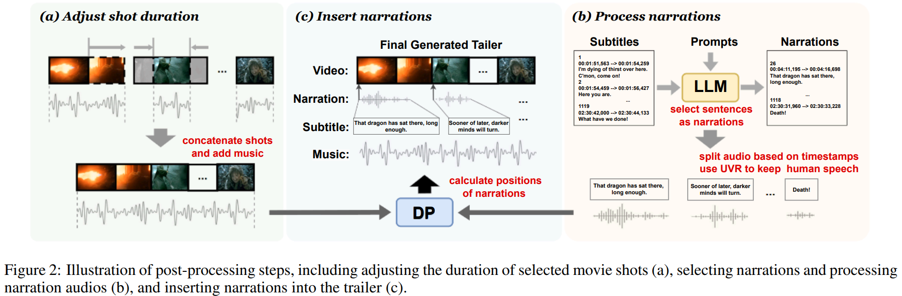
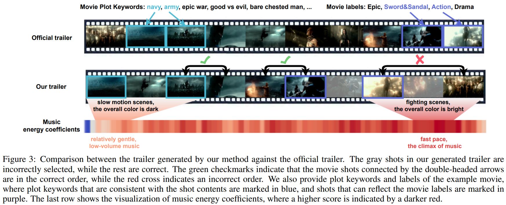

# [IJCAI 2025] Weakly-Supervised Movie Trailer Generation Driven by Multi-Modal Semantic Consistency

<div style="display: flex; justify-content: center; align-items: center;">
  <a href="https://github.com/Dixin-Lab/MMSC" style="margin: 0 2px;">
    
  </a>
  <a href='[https://www.bilibili.com/video/BV15sWMeAE8R/?spm_id_from=333.999.0.0&vd_source=4526cf207f29ce6d50810b04d3105cfd](https://space.bilibili.com/487967491/lists/4641072?type=series)' style="margin: 0 2px;">
    
  </a>
<!--   <a href="https://github.com/Zheng-Chong/CatVTON/LICENCE" style="margin: 0 2px;">
    
  </a> -->
</div>

**TL;DR**: Given a raw video, a piece of music, video metadata (i.e., video plot keywords and category labels), and video subtitles, we can generate an appealing video trailer/montage with narration. 


## 👀 Generated Trailer Demo
[Here](https://drive.google.com/drive/folders/1WhIYdZgL7N4XBV9-uAl5qUzikkoKnFDZ?hl=zh-CN) are some example trailers for two movies (**300 Rise of an Empire** and **The Hobbit**) generated using our approach, which you can download and view from the link.

## ⏳ Project Structure
```
.
├── dataset
|   ├── training_dataset
|   |   ├── train_audio_shot_embs (npy format, segmented audio shots)
|   |   ├── train_movie_shot_embs (npy format, segmented movie shots)
|   |   ├── train_trailer_shot_embs (npy format, segmented trailer shots)
|   |   ├── train_labels_embs (npy format, movie category labels)
|   |   ├── train_keywords_embs (npy format, movie plot keywords)
|   |   ├── train_trailerness_score (npy format, processed trailerness score of each movie shot)
|   |   └── train_emotion_score (npy format, processed emotion score of each movie shot)
|   └── test_dataset
|       ├── test_audio_shot_embs (npy format, segmented audio shots)
|       ├── test_movie_shot_embs (npy format, segmented movie shots)
|       ├── test_trailer_shot_embs (npy format, segmented trailer shots)
|       ├── test_labels_embs (npy format, movie category labels)
|       ├── test_keywords_embs (npy format, movie plot keywords)
|       ├── test_trailerness_score (npy format, processed trailerness score of each movie shot)
|       └── test_emotion_score (npy format, processed emotion score of each movie shot)
|—— checkpoint
|   └── network_1500.net
|—— model.py
|—— trailer_generator.py
|—— pre-processing
|   ├── segmentation
|   |   ├── shot_segmentation_transnetv2.py
|   |   └── seg_audio_based_on_shots.py
|   ├── pesudo_score_calculation
|   |   ├── trailerness_pesudo_score.py
|   |   ├── music_mfcc_score.py
|   |   └── emotion_pesudo_score.py
|   └── feature_extratction
|—— post-processing
|   ├── deepseek_narration_selection.py
|   ├── mini_shot_caption.py
|   └── dp_narration_insertion.py
└── utils
```
## ⚙️ Main Dependencies
- python=3.8.19
- pytorch=2.3.0+cu121
- numpy=1.24.1
- matplotlib=3.7.5
- scikit-learn=1.3.2
- scipy=1.10.1
- sk-video=1.1.10
- ffmpeg=1.4

Or create the environment by:
```commandline 
pip install -r requirements.txt
```

## 🎞 Dataset
###  Dataset structure
We expand CMTD dataset from 200 movies to 500 movies for movie trailer generation and future video understanding tasks. We train and evaluate various trailer generators on this dataset. Please download the new dataset from these links: [MMSC_DATASET](https://drive.google.com/drive/folders/1Iw6OXMi6_nyFyvyK5hXb_aYwRTcg7oHj?usp=drive_link). Compared with CMTD dataset, MMSC dataset contains extrated movie category labels embeddings, movie plot keywords embeddings, processed movie trailerness scores, and processed movie emotion scores.
It is worth noting that due to movie copyright issues, we cannot provide the original movies. The dataset only provides the visual and acoustic features extracted by ImageBind after we segmented the movie shot and audio shot using TransNet V2.

### Model ckpt
We provide the trained model ```network_1500.net``` under the checkpoint folder.

## 🎥 Pre-processing
### Movie/Trailer Shot Segmentation 
We use [TransNet V2](https://github.com/soCzech/TransNetV2), a shot transition detection model, to split each movie into movie shots. The codes can be found in ```./pre-processing/segmentation/shot_segmentation_transnetv2.py```. 
If you want to perform shot segmentation on your local video, please be aware of modifying the path for reading the video and the path for saving the segmentation results in the code.

```commandline
movie_dataset_base = '' # video data directory
movies = os.listdir(movie_dataset_base)

save_scene_dir_base = '' # save directory of scene json files 
finished_files = os.listdir(save_scene_dir_base)
```

### Segment audio based on trailer shots
During the training phase, in order to obtain aligned trailer shots and audio shots from each official trailer, we segment the official trailer audio according to the duration of the trailer shots.
The codes can be found in ```./pre-processing/segmentation/seg_audio_based_on_shots.py```. 
If you want to perform audio segmentation based on your trailer shot segmentation, please be aware of modifying the path for reading the audio and the path for saving the segmentation results in the code.

```commandline
seg_json = dict()  # save the segmentation info of audio 
base = ''
save_seg_json_name = 'xxx.json'
save_bar_base = ""
scene_trailer_base = ""
audio_base = ""
```

### Music Shot Segmentation
If you want to perform audio segmentation based on your own music, you can use [Ruptures](https://github.com/deepcharles/ruptures) to split music into music shots, the code can be found in ```./pre-processing/segmentation/scene_segmentation_ruptures.py```. 
please be aware of modifying the path for reading the audio and the path for saving the segmentation results in the code.

```commandline
audio_file_path = ''  # music data path
save_result_base = ''  # save segmentation result
```

### Feature Extraction
We use [ImageBind](https://github.com/facebookresearch/ImageBind) to extract visual features of movie shots and textual features of movie metadata, and use [CLAP](https://github.com/LAION-AI/CLAP) to extract acoustic features of audio shots. 
The codes can be found in ```./pre-processing/feature_extraction/```.  

### Pseudo-Score Calculation
The code of trailerness and emotion pseudo-score calculation can be found in ```./pre-processing/pesudo_score_calculation/```. 
The trailerness pseudo-score measures the likelihood of each shot being selected for the trailer, while the emotion pseudo-score reflects the emotional intensity of each movie shot.


## ✂️ Post-processing

### Trailer Narration Selection based on Deepseek-V3
We use [DeepSeek-V3](https://huggingface.co/deepseek-ai/DeepSeek-V3-0324), a pre-trained large language model (LLM), to analyze and select the movie’s subtitles. As shown in Figure 2(b), the LLM takes the movie’s subtitles with timestamps and some instructional prompts as input and selects some subtitles as the narration of the generated trailer.
The code can be found in  ```./post-processing/deepseek_narration_selection.py```

### Trailer Shot Captioning
We utilize [MiniCPM-V 2.6](https://huggingface.co/openbmb/MiniCPM-V-2_6), a multi-modal LLM for video captioning, to generate a one-sentence description for each shot of the generated trailer.
The code can be found in  ```./post-processing/mini_shot_caption.py```

### Narration Insertion
Based on the selected narration timestamps, we determine the positions of the selected narrations through solving a dynamic programming problem. 
We extract the textual features of the shot descriptions and the selected narrations by ImageBind, and calculate their pairwise similarities.
Accordingly, we associate each narration with a shot by maximizing the sum of the similarities between all narrations and the shot descriptions under the constraint that the narrations do not overlap.
We set the constraint that the time difference between any two narrations must be greater than the duration of the preceding narration.
Under this constraint, we maximize the sum of the similarity between each narration and its corresponding trailer shot.
This ensures both that the narrations do not overlap and that each narration is highly relevant to the trailer shot at its insertion position.
The code can be found in ```./post-processing/dp_narration_insertion.py```



## 🎇 Generate your own trailer!
When given a long video (e.g., a full movie, video_name.mp4), a piece of music (e.g., audio_name.wav), video metadata (video plot keywords and category labels), and video narration, 
1) Resize the input video to 320p, and generate the intra-frame coding version of the input video to make the segmented movie shots more accurate. 

``` python ./utils/intra_video_ffmpeg.py; python ./utils/rescale_movies_ffmpeg.py```

2) Segment the input 320p video into movie shots through BaSSL.

``` python ./pre-processing/segmentation/scene_segmentation_bassl.py```

3) Segment the input music into music shots through ruptures.

``` python ./pre-processing/segmentation/audio_segmentation_ruptures.py```

4) Calculate the MFCC score of segmented music shots.

``` python ./pre-processing/pesudo_score_calculation/music_mfcc_score.py```

5) Encode the movie shots into shot-level visual embeddings through ImageBind.

``` python ./pre-processing/feature_extraction/extract_video_embs.py```

6) Encode the music shots into shot-level acoustic embeddings through ImageBind.

``` python ./pre-processing/feature_extraction/extract_audio_embs.py```

7) Encode the movie metadata into text embeddings through ImageBind.

``` python ./pre-processing/feature_extraction/extract_text_embs.py```

8) With the processed embeddings, we can just run ``` python trailer_generator.py``` to generate the personalized trailers. 

**Note: the (5) to (7) steps, the python files should be placed at the [ImageBind repo](https://github.com/facebookresearch/ImageBind), e.g., at './ImageBind/' directory.**

## 📖Citation
Please cite our paper if you use this code or dataset:
```
@inproceedings{

}
```
