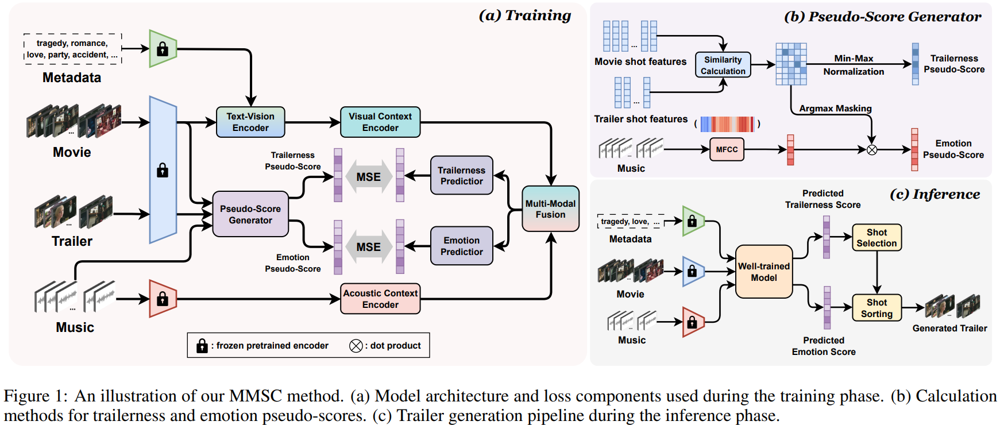

# [IJCAI 2025] Weakly-Supervised Movie Trailer Generation Driven by Multi-Modal Semantic Consistency

<div style="display: flex; justify-content: center; align-items: center;">
  <a href="https://github.com/Dixin-Lab/MMSC" style="margin: 0 2px;">
    
  </a>
  <a href='[https://www.bilibili.com/video/BV15sWMeAE8R/?spm_id_from=333.999.0.0&vd_source=4526cf207f29ce6d50810b04d3105cfd](https://space.bilibili.com/487967491/lists/4641072?type=series)' style="margin: 0 2px;">
    
  </a>
<!--   <a href="https://github.com/Zheng-Chong/CatVTON/LICENCE" style="margin: 0 2px;">
    
  </a> -->
</div>

**TL;DR**: Given a raw video, a piece of music, and the corresponding metadata of the given video (i.e., video plot keywords and category labels), we can generate an appealing video trailer/montage driven by multi-modal semantic consistency. 



## ⏳ Project Struture
```
.
├── dataset
|   ├── training_dataset
|   |   ├── audio_shot_embs (npy format, segmented audio shots)
|   |   ├── movie_shot_embs (npy format, segmented movie shots)
|   |   └── trailer_shot_embs (npy format, segmented trailer shots)
|   └── test_dataset
|       ├── audio_shot_embs (npy format, segmented audio shots)
|       ├── movie_shot_embs (npy format, segmented movie shots)
|       └── trailer_shot_embs (npy format, segmented trailer shots)
|—— checkpoint
|   └── network_1500.net
├── pesudo-score_calculation
├── feature_extratction
├── shot_segmentation
└── utils
```
## ⚙️ Main Dependencies
- python=3.8.19
- pytorch=2.3.0+cu121
- numpy=1.24.1
- matplotlib=3.7.5
- scikit-learn=1.3.2
- scipy=1.10.1
- sk-video=1.1.10
- ffmpeg=1.4

Or create the environment by:
```commandline 
pip install -r requirement.txt
```
